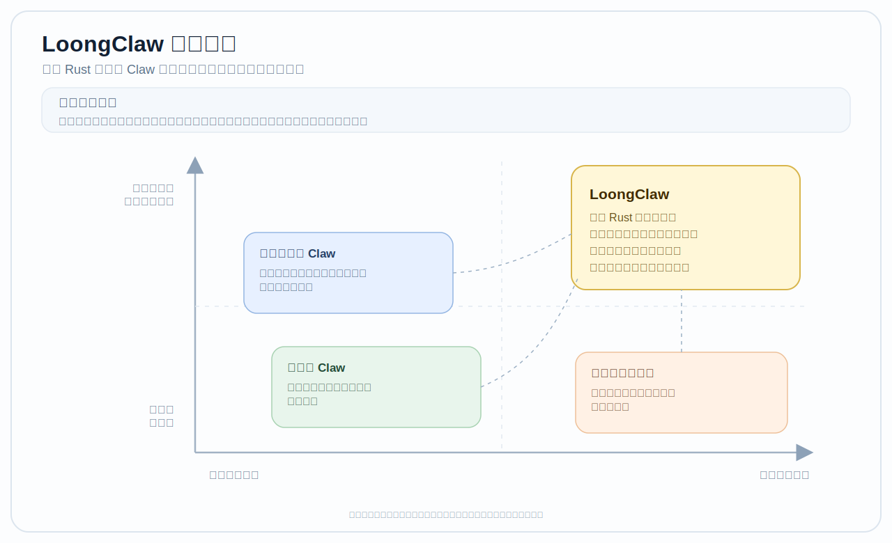
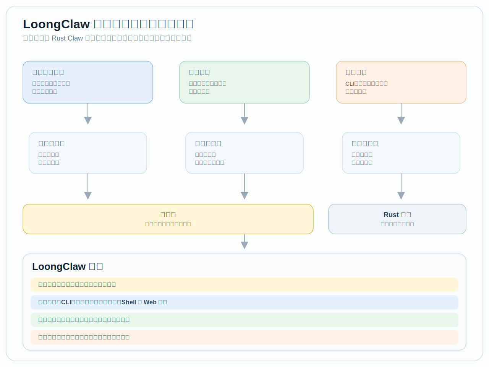

# 🐉 LoongClaw - 面向垂域智能体的安全基座

<p align="center">
  <picture>
    <source media="(prefers-color-scheme: dark)" srcset="assets/logo/loongclaw-logo-dark.png" />
    <source media="(prefers-color-scheme: light)" srcset="assets/logo/loongclaw-logo-light.png" />
    
  </picture>
</p>
<h3 align="center"><em>“发轫于东，以会群友”</em></h3>

<p align="center">
  <strong>LoongClaw 是一套基于 Rust 构建的安全、可扩展、可持续演进的 Claw 基座。</strong><br/>
  它以助手能力为起点，但目标并不停留于通用助手，而是逐步成长为面向团队的垂域智能体基础层，让人与 AI 能在真实场景中持续协作、共同进化。
</p>

<p align="center">
  <a href="https://github.com/loongclaw-ai/loongclaw/actions/workflows/ci.yml?branch=dev"></a>
  <a href="LICENSE-MIT"></a>
  
  <a href="https://github.com/loongclaw-ai/loongclaw/releases"></a>
  </br>
  <a href="https://x.com/loongclawai"></a>
  <a href="https://t.me/loongclaw"></a>
  <a href="https://discord.gg/7kSTX9mca"></a>
  <a href="https://www.reddit.com/r/LoongClaw"></a>
  <br/>
  <a href="https://xhslink.com/m/1dqFqF1IKDk"></a>
  <a href="https://loongclaw.ai/feishu.jpg"></a>
  <a href="https://loongclaw.ai/wechat.jpg"></a>
</p>

<p align="center">
  <a href="README.md">English</a> |
  <a href="README.zh-CN.md">简体中文</a>
</p>

<p align="center">
  <a href="#why-loong">为什么选择 Loong</a> •
  <a href="#product-positioning">产品定位</a> •
  <a href="#why-teams-build-on-loongclaw">优势</a> •
  <a href="#contributing">贡献</a> •
  <a href="#quick-start">快速开始</a> •
  <a href="#migrate-existing-setup">迁移</a> •
  <a href="#core-capabilities">核心能力</a> •
  <a href="#architecture-overview">架构</a> •
  <a href="#documentation">文档</a>
</p>

---

<a id="why-loong"></a>
## 为什么选择 Loong

我们没有直接用“dragon”，而是选择了 **Loong**。

Loong 指向的是中文语境里的“龙”。在我们的理解里，它不是一个强调征服和对抗的形象，更像是一种温和但有力量的存在：有生命力，也有分寸；有想象力，也懂得协同；愿意向上生长，也愿意与万物共处。这种气质，和我们想做的 LoongClaw 很接近。

LoongClaw 不想只是做一个“更会聊天的通用 Claw”。我们更希望它能陪着个体和团队在具体场景中一起成长，慢慢成为一个真正可靠、可塑、可持续演进的智能体基座。对我们来说，Loong 不只是一个名字，也对应着一种我们希望长期坚持的做事方式：尊重差异、保持开放、平等互惠、看重长期、脚踏实地。

我们希望围绕 LoongClaw 形成的社区也能保有这样的气质：少一点喧哗和姿态，多一点围绕真实问题的合作；让贡献者、用户和伙伴能够彼此信任、一起共创，把事情一件件做好。

## 赞助商

<p align="center">
  <a href="https://www.volcengine.com/activity/codingplan?utm_campaign=loongclaw&utm_content=loongclaw&utm_medium=devrel&utm_source=OWO&utm_term=loongclaw">
    <picture>
      <source media="(prefers-color-scheme: dark)" srcset="assets/sponsors_logo/volcengine/volcengine-logo-dark-zh.png"/>
      
    </picture>
  </a>
  <span>&emsp;&emsp;&emsp;</span>
  <a href="https://www.feishu.cn">
    <picture>
      <source media="(prefers-color-scheme: dark)" srcset="assets/sponsors_logo/feishu/feishu-logo-dark-zh.png"/>
      
    </picture>
  </a>
</p>

<a id="product-positioning"></a>

## 产品定位

<p align="center">
  
</p>

### LoongClaw 今天是什么

今天的 LoongClaw，已经不是一个“把模型接进 CLI”的薄壳，而是一套**基于 Rust 构建、边界清晰、可继续塑形的 Claw 基础底座**。如果只看 `onboard`、`ask`、`chat` 这些入口命令，很容易低估它；但从代码结构看，LoongClaw 已经具备了团队真正关心的多项基础能力。

| 核心能力 | 当前已具备 | 为什么这件事重要 |
|----------|--------------|------------------|
| 治理内建 | 能力令牌、策略判定、审批请求和审计事件已经进入关键执行路径 | 更适合进入真实团队流程，而不只是单机 demo |
| 独立执行层 | `connector`、`runtime`、`tool`、`memory` 在 kernel 内分成独立执行层，核心与扩展适配器采用统一的注册方式 | 做垂直领域能力时可以替换单个执行层，而不是反复改内核 |
| 控制层分离 | ACP 已经是独立控制层，覆盖 backend、binding、registry、runtime、analytics、store 等模块 | 更适合承接后续路由、协作和更复杂的智能体生命周期 |
| 上下文可定制 | context engine 已具备 `bootstrap`、`ingest`、`after_turn`、`compact_context` 和 subagent hooks | 上下文与记忆不是写死在一段段拼装的 prompt 中 |
| 工具能力与运行时状态一致 | tool catalog 自带风险等级、审批模式和 `Runtime / Planned` 可见性 | 用户看到的能力，更接近系统此刻真的能做什么 |
| 启动时自动探测迁移 | `onboard` 会探测 current setup、Codex config、environment 和 workspace guidance；公开迁移入口已统一为 `loongclaw migrate` | 团队不必从零开始重搭配置与长期偏好 |
| 多通道交付 | CLI、Telegram、飞书 / Lark 都已经有类型化配置、路由和安全校验 | 它更像一个正在成型的团队产品，而不是只存在于本地终端的实验品 |

这也是我们更愿意把 LoongClaw 看成“垂域智能体基础层雏形”的原因。它不是等愿景成熟之后再回头补系统骨架的临时产物，而是自诞生之日起就已经有治理边界、扩展边界和交付边界的完整产品。

### 我们的愿景

LoongClaw 的目标不只是个人助手。

我们的愿景，是把 LoongClaw 塑造成一个**面向垂域智能体的基础层**：比通用助手更聚焦、更可控，也更适合进入真实场景和具体流程。我们希望团队能够基于稳定内核与清晰的扩展接口，通过低代码 / 零代码的方式，更快构建并持续演进自己的垂域智能体，而不是每次都从头搭系统。

这个方向也不只停留在软件工作流里。再往后看，我们也关心硬件、机器人以及具身智能相关的延展空间。对我们来说，LoongClaw 的价值不单单是把模型接进聊天界面，而是逐步长成一个能够连接数字世界与真实行动的基础层。

<a id="why-teams-build-on-loongclaw"></a>

## 为什么团队会选择 LoongClaw

如果把 LoongClaw 放到常见的 AI agent 产品中来看，它兼顾了”开箱即用的助手基座”和”可治理的垂直领域底座”两种优势，并从一开始就将两者发展过程供真正会遇到的问题提前纳入系统设计。

### 设计取向横向对比

| 设计取向 | 助手型产品常见做法 | 框架型产品常见做法 | LoongClaw 的选择 |
|----------|--------------------|--------------------|------------------|
| 起点 | 先优化单人对话体验 | 先提供高度灵活但偏空的搭建框架 | 先给出可运行的基础版本，同时提前引入团队协作所需的治理边界 |
| 治理 | 往往依赖外围系统补策略、审批、审计 | 可以做，但通常需要二次集成 | 把 policy、approval、audit 放进关键执行路径 |
| 扩展方式 | 常靠插件或脚本后补 | 自由度高，但容易每个团队重搭一套 | 用 plane、adapter、pack 和 channel 去做有边界的扩展 |
| 接入方式 | 多停留在 CLI 或单一聊天入口 | 更像底层框架，本身接入方式较少 | CLI、Telegram、飞书 / Lark 已是实际可用的接入方式 |
| 垂域演进 | 容易停在“更会聊天” | 容易停在“能搭，但要自己补很多” | 目标是在稳定 Rust 底座上持续塑造垂域智能体 |
| 长线方向 | 以软件助手为主 | 以 orchestration 为主 | 同时为硬件、机器人与具身智能预留延展空间 |

<p align="center">
  
</p>

<a id="quick-start"></a>
## 快速开始

### 安装脚本

安装脚本会优先下载与当前平台匹配的 GitHub Release 二进制，校验 SHA256，
安装 `loongclaw`，并在需要时直接进入引导式初始化。

当你传入 `--onboard` 时，安装脚本现在会先为 onboarding 注入一个推荐的
web search 默认 provider。通用默认仍然是无需密钥的 DuckDuckGo；如果本地
语言/时区/网络探测更像中国大陆环境，则会优先把 Tavily 作为更稳妥的首次默认值。
如果当前 shell 里已经只暴露出一个可直接使用的搜索凭证，例如
`PERPLEXITY_API_KEY` 或 `TAVILY_API_KEY`，安装脚本会先优先选择那个
provider，再退回到地区和连通性启发式。

<details>
<summary>Linux / macOS</summary>

```bash
curl -fsSL https://raw.githubusercontent.com/loongclaw-ai/loongclaw/dev/scripts/install.sh | bash -s -- --onboard
```
</details>

<details>
<summary>Windows (PowerShell)</summary>

```powershell
$script = Join-Path $env:TEMP "loongclaw-install.ps1"
Invoke-WebRequest https://raw.githubusercontent.com/loongclaw-ai/loongclaw/dev/scripts/install.ps1 -OutFile $script
pwsh $script -Onboard
```
</details>

### 从源码构建

<details>
<summary>源码安装</summary>

```bash
bash scripts/install.sh --source --onboard
```

```powershell
pwsh ./scripts/install.ps1 -Source -Onboard
```

```bash
cargo install --path crates/daemon
```
</details>

### 第一次成功路径

1. 运行引导式首次配置：

   ```bash
   loongclaw onboard
   ```

2. 设置初始化时选中的 provider 凭据：

   ```bash
   export PROVIDER_API_KEY=sk-...
   ```

   如果你使用 Volcengine，可以直接参考下文“配置”里的示例。

3. 先拿到一次回答：

   ```bash
   loongclaw ask --message "总结这个仓库，并告诉我最值得先做的下一步。"
   ```

4. 需要持续会话时进入：

   ```bash
   loongclaw chat
   ```

5. 本地健康有问题时执行：

   ```bash
   loongclaw doctor --fix
   ```

先把 CLI 这条基础路径走通，再继续配置其他通道。

## 配置

`loongclaw onboard` 默认通过 `provider.api_key = { env = "..." }` 引用 provider 凭据，让密钥不直接写进配置文件：

```toml
active_provider = "openai"

[providers.openai]
kind = "openai"
api_key = { env = "PROVIDER_API_KEY" }
```

现在 onboarding 也支持选择默认的 web search backend。当前支持
`duckduckgo`、`brave`、`tavily`、`perplexity`、`exa`、`jina`。
如果你直接接受默认值，LoongClaw 会在通用场景下使用 DuckDuckGo；当本地
语言/时区/网络特征更像中国大陆环境时，会优先推荐 Tavily。若你选择的
provider 需要密钥，onboarding 会立刻继续询问“用哪个环境变量承载这份凭据”，
并把配置写成 `"${TAVILY_API_KEY}"` 这种 env 引用，而不是要求把密钥明文写进
配置文件。非交互 onboarding 现在也支持
`--web-search-provider <provider>` 和 `--web-search-api-key <ENV_NAME>`；
一旦你显式指定了 provider，LoongClaw 不会再静默回退到 DuckDuckGo。

```toml
[tools.web_search]
default_provider = "duckduckgo"
# brave_api_key = "${BRAVE_API_KEY}"
# tavily_api_key = "${TAVILY_API_KEY}"
# perplexity_api_key = "${PERPLEXITY_API_KEY}"
# exa_api_key = "${EXA_API_KEY}"
# jina_api_key = "${JINA_API_KEY}"
# 或 "${JINA_AUTH_TOKEN}"
```

Volcengine Coding Plan / ARK 示例：

```bash
export ARK_API_KEY=your-ark-api-key
```

```toml
active_provider = "volcengine"

[providers.volcengine]
kind = "volcengine"
model = "your-coding-plan-model-id"
api_key = { env = "ARK_API_KEY" }
base_url = "https://ark.cn-beijing.volces.com"
chat_completions_path = "/api/v3/chat/completions"
```

飞书通道示例（webhook 模式）：

```bash
export FEISHU_APP_ID=cli_your_app_id
export FEISHU_APP_SECRET=your_app_secret
export FEISHU_VERIFICATION_TOKEN=your_verification_token
export FEISHU_ENCRYPT_KEY=your_encrypt_key
```

```toml
[feishu]
enabled = true
receive_id_type = "chat_id"
webhook_bind = "127.0.0.1:8080"
webhook_path = "/feishu/events"
allowed_chat_ids = ["oc_your_chat_id"]
```

```bash
loongclaw feishu-serve --config ~/.loongclaw/config.toml
```

默认是 `mode = "webhook"`，会读取 `FEISHU_APP_ID`、`FEISHU_APP_SECRET`、`FEISHU_VERIFICATION_TOKEN` 和 `FEISHU_ENCRYPT_KEY`。

飞书通道示例（websocket 模式）：

```bash
export FEISHU_APP_ID=cli_your_app_id
export FEISHU_APP_SECRET=your_app_secret
```

```toml
[feishu]
enabled = true
mode = "websocket"
receive_id_type = "chat_id"
allowed_chat_ids = ["oc_your_chat_id"]
```

```bash
loongclaw feishu-serve --config ~/.loongclaw/config.toml
```

websocket 模式不需要 webhook secret。如果你接的是 Lark，可以再加上 `domain = "lark"`。

### 多通道运行

当你希望一个进程把交互式 CLI 会话放在前台，同时在同一运行时里监督 Telegram 和飞书通道时，使用 `multi-channel-serve`。

```bash
loongclaw multi-channel-serve \
  --session cli-supervisor \
  --telegram-account bot_123456 \
  --feishu-account alerts \
  --config ~/.loongclaw/config.toml
```

`--session` 是必填项。`--telegram-account` 和 `--feishu-account` 是可选的通道账号选择参数，用来指定这个运行时要监督的账号。

工具策略需要明确配置：

```toml
[tools]
shell_default_mode = "deny"
shell_allow = ["echo", "ls", "git", "cargo"]

[tools.browser]
enabled = true
max_sessions = 8

[tools.web]
enabled = true
allowed_domains = ["docs.example.com"]
blocked_domains = ["*.internal.example"]

[tools.web_search]
enabled = true
default_provider = "duckduckgo" # 也可以用 "ddg"、"brave"、"tavily"、"perplexity"、"exa"、"jina"
timeout_seconds = 30
max_results = 5
# brave_api_key = "${BRAVE_API_KEY}"
# tavily_api_key = "${TAVILY_API_KEY}"
# perplexity_api_key = "${PERPLEXITY_API_KEY}"
# exa_api_key = "${EXA_API_KEY}"
# jina_api_key = "${JINA_API_KEY}"
# 或 "${JINA_AUTH_TOKEN}"
```

进一步参考：

- `default_provider` 支持 `duckduckgo`（或 `ddg`）、`brave`、`tavily`、`perplexity`（或 `perplexity_search`）、`exa`、`jina`（或 `jinaai` / `jina-ai`）
- `BRAVE_API_KEY`、`TAVILY_API_KEY`、`PERPLEXITY_API_KEY`、`EXA_API_KEY`、`JINA_API_KEY`、`JINA_AUTH_TOKEN` 都可以作为环境变量回退
- [工具策略配置](docs/configuration/tool-policy.md)
- [产品规格](docs/product-specs/index.md)
- `loongclaw validate-config --config ~/.loongclaw/config.toml --json`

<a id="migrate-existing-setup"></a>

## 从其他 Claws 或 Agents 迁移已有设置

LoongClaw 不要求用户从零开始重新配置。

当前实现里，迁移有两条路径：

- `onboard` 会把 current setup、Codex config、环境变量和 workspace guidance 一起纳入 starting point 探测，并给出建议起点。
- 当你需要更明确的控制时，公开迁移入口已经统一为 `loongclaw migrate`，用于扫描、规划、选择性应用和回滚迁移结果。

它的价值不只是“搬一份 config”。LoongClaw 会区分 source、给出推荐主源，并把迁移拆成 prompt、profile、external skills 等更细的 lane，而不是把历史状态整块硬覆盖到新系统里。

```bash
# 扫描候选迁移来源
loongclaw migrate --mode discover --input ~/legacy-claws

# 规划所有来源并给出推荐主源
loongclaw migrate --mode plan_many --input ~/legacy-claws

# 选择单一来源应用到目标配置
loongclaw migrate --mode apply_selected --input ~/legacy-claws \
  --source-id openclaw --output ~/.loongclaw/config.toml --force

# 回滚最近一次迁移
loongclaw migrate --mode rollback_last_apply --output ~/.loongclaw/config.toml
```

更深一层的迁移模式还包括 `merge_profiles` 和 `map_external_skills`，分别用于多来源 profile 合并和外部 skills 工件映射。

<a id="core-capabilities"></a>
## 核心能力

### 治理与受控执行

- kernel 内已经有能力令牌、授权、撤销和审计事件这些治理原语
- 工具目录自带风险等级、审批模式和运行时可见性，高风险动作可以进入审批流
- `browser` 与 `web` 工具复用同一套受控网络边界，外部技能也默认走显式策略

### 执行层与扩展接口

- kernel 明确拆分 `connector`、`runtime`、`tool`、`memory` 四个 execution planes
- 各 plane 都提供 core / extension adapter 组织方式，扩展走正门，而不是直接侵入内核
- provider、tool、memory、channel 与 pack 可以在清晰边界上持续演化

### 上下文、记忆与控制面

- context engine 拥有 `bootstrap`、`ingest`、`after_turn`、`compact_context` 和 subagent lifecycle hooks
- ACP 作为独立控制面承担 backend、binding、registry、runtime 等协同职责
- profiles、summaries、migration 与 canonical history 一起承接长期上下文

### 接入方式

- CLI 是当前的主要入口，但并不是唯一的接入方式
- Telegram 轮询与飞书 / Lark webhook 已有实际通道实现与安全校验
- `browser`、`file`、`shell`、`web` 等工具通过运行时策略暴露，而不是散在外围脚本里

## 架构概览

LoongClaw 采用严格 DAG 的 7-crate Rust workspace：

```text
contracts (leaf -- zero internal deps)
├── kernel --> contracts
├── protocol (independent leaf)
├── app --> contracts, kernel
├── spec --> contracts, kernel, protocol
├── bench --> contracts, kernel, spec
└── daemon (binary) --> all of the above
```

| Crate | 角色 |
|-------|------|
| `contracts` | 稳定共享 ABI 接口 |
| `kernel` | 策略、审计、能力、pack 与治理核心 |
| `protocol` | 类型化传输与路由契约 |
| `app` | 模型提供方、工具、通道、记忆与对话运行时 |
| `spec` | 确定性执行规格 |
| `bench` | 基准测试与门禁 |
| `daemon` | 可运行 CLI 二进制与面向操作者的命令入口 |

最重要的三条原则：

- **治理优先**：策略、审批与审计原本就是架构设计的一部分，位于关键执行路径中
- **加法式演进**：公开契约只做增量演进，保持已有集成的兼容性
- **小内核，丰富且清晰的扩展接口**：垂直化应该发生在 adapters、packs 和产品层，而不是每次都直接改 kernel

### 可插拔设计与当前落地

- **小内核、强边界**：`contracts`、`kernel`、`protocol`、`app` 分层，让传输、策略、运行时和产品层逻辑各自演进，而不是彼此缠死。
- **Core / Extension 思路**：运行时、工具、记忆、连接器都按“核心适配器 + 扩展适配器”的方向组织，扩展走正门，而不是绕过内核。
- **控制层与执行层分离**：模型轮次、上下文组装、通道路由与 ACP 控制层分开建模，后续做更复杂的协作、路由和调度时，不必推倒对话核心重写。
- **治理不是后补丁**：能力、策略、审批与审计从一开始就被放进关键调用路径里，而不是等接近上线时再补外围约束。
- **今天已经可用的产品层**：`onboard`、`ask`、`chat`、`doctor`、CLI 主入口、Telegram / 飞书通道、`browser` / `file` / `shell` / `web` 工具，以及可配置的模型提供方、记忆与工具策略默认配置。

更长线的插件生态与集成控制能力，确实是我们关心的方向；但在 README 里，我们更愿意把它表述成正在展开的架构能力，而不是已经完全成熟的产品现实。

完整分层模型见 [ARCHITECTURE.md](ARCHITECTURE.md) 与 [Layered Kernel Design](docs/design-docs/layered-kernel-design.md)。

<a id="documentation"></a>
## 文档

| 文档 | 描述 |
|------|------|
| [架构](ARCHITECTURE.md) | crate 地图与分层执行概览 |
| [核心信念](docs/design-docs/core-beliefs.md) | 核心工程原则 |
| [路线图](docs/ROADMAP.md) | 阶段里程碑与演进方向 |
| [产品感知](docs/PRODUCT_SENSE.md) | 当前产品契约与用户路径 |
| [产品规格](docs/product-specs/index.md) | `onboard`、`ask`、`doctor`、通道、记忆等用户侧要求 |
| [贡献重点方向](docs/references/contribution-areas.zh-CN.md) | 当前最需要的设计、工程、文档与社区协作方向 |
| [可靠性](docs/RELIABILITY.md) | 构建与内核不变量 |
| [安全策略](SECURITY.md) | 安全政策与披露路径 |
| [变更日志](CHANGELOG.md) | 发布历史 |

<a id="contributing"></a>
## 贡献

欢迎贡献。完整工作流请见 [CONTRIBUTING.md](CONTRIBUTING.md)。

如果你想先了解当前最需要帮助的方向，可以先看
[Contribution Areas We Especially Welcome](docs/references/contribution-areas.zh-CN.md)。

- [贡献指南](CONTRIBUTING.md)
- [贡献重点方向](docs/references/contribution-areas.zh-CN.md)
- [行为准则](CODE_OF_CONDUCT.md)
- [安全政策](SECURITY.md)

## 许可证

LoongClaw 基于 [MIT 许可证](LICENSE-MIT) 发布。

Copyright (c) 2026 LoongClaw AI

## Star History

<p align="center">
  <a href="https://star-history.com/#loongclaw-ai/loongclaw&Date">
    <picture>
      <source media="(prefers-color-scheme: dark)" srcset="https://api.star-history.com/svg?repos=loongclaw-ai/loongclaw&type=Date&theme=dark"/>
      
    </picture>
  </a>
</p>
